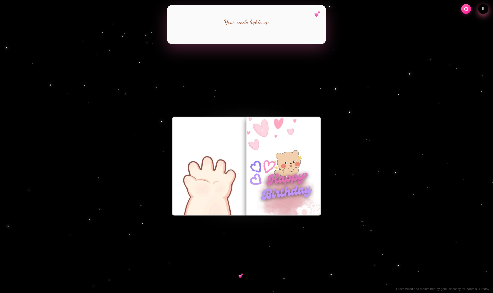

# 🎉 GS Birthday Site

A beautiful, interactive birthday website with animations, music, and a photo book feature. Perfect for creating memorable birthday surprises!




## ✨ Features

- 🎨 **Beautiful Animations**: Matrix rain effect, floating hearts, fireworks, and twinkling stars
- 📖 **Interactive Photo Book**: 3D book with customizable pages
- 🎵 **Background Music**: Auto-playing birthday music (can be paused/played)
- 🎨 **Customizable Themes**: Choose from Pink, Blue, Purple, or create your own custom colors
- 🌐 **Multi-language Support**: English and French
- 📱 **Responsive Design**: Works on desktop, tablet, and mobile devices

## 🚀 Quick Start

### Option 1: Open Directly
Simply double-click `index.html` to open the site in your default browser.

### Option 2: VS Code Live Server
1. Open the folder in VS Code
2. Right-click on `index.html`
3. Select "Open with Live Server"

## 📸 How to Add Your Own Photos

1. **Prepare Your Photos**
   - Create or use the `image/Birthday!` folder
   - Add your photos with filenames: `1.jpg`, `2.jpg`, `3.jpg`, etc.
   - Supported formats: JPG, PNG, GIF
   - Recommended size: 800x600 pixels or similar aspect ratio

2. **Update the Photo Book**
   - The site automatically loads photos from the `image/Birthday!` folder
   - Photos will appear in the interactive 3D book
   - You can add as many photos as you want

3. **Photo Organization**
   ```
   image/
   ├── Birthday!/
   │   ├── 1.jpg
   │   ├── 2.jpg
   │   ├── 3.jpg
   │   └── ... (add more photos)
   ├── logo.png
   ├── screen.png
   └── full.png
   ```

## 🎵 How to Add Your Own Music

1. **Prepare Your Music File**
   - Format: MP3 (recommended for best compatibility)
   - Keep file size reasonable (under 5MB recommended)

2. **Replace the Music**
   - Navigate to the `music/` folder
   - Replace `SZA - Saturn - SZAVEVO.mp3` with your own music file
   - **OR** rename your music file to `SZA - Saturn - SZAVEVO.mp3`

3. **Update the HTML (if using different filename)**
   - Open `index.html`
   - Find line 188: `<source src="./music/SZA - Saturn - SZAVEVO.mp3" type="audio/mpeg">`
   - Change `SZA - Saturn - SZAVEVO.mp3` to your music filename

## 🎨 Customization

### Change the Recipient Name
Open `index.html` and update these lines:
- Line 7: `<title>GS Birthday Site 🎁</title>`
- Line 9, 16-18, 25-27: Update meta descriptions
- Line 179: Update the birthday message
- Line 193: Update the copyright message

### Change Color Theme
1. Click the ⚙️ Settings button on the site
2. Choose from:
   - 🌸 Sweet Pink (default)
   - 💙 Cool Blue
   - 💜 Dreamy Purple
   - 🎨 Custom Color (pick your own)

### Customize Messages
Edit `lang.js` to change the text content:
```javascript
const translations = {
    en: { /* English messages */ },
    fr: { /* french messages */ }
}
```

## 📁 Project Structure

```
gs-birthday-site/
├── 📄 index.html              # Main HTML file
├── 📄 lang.js                 # Language translations
├── 📄 README.md               # This file
├── 📄 .gitignore              # Git ignore rules
│
├── 📁 css/
│   └── index.css              # All styles and animations
│
├── 📁 jscp/
│   ├── settings.js           # Settings management
│   ├── main.js               # Main functionality
│   └── ui.js                 # UI interactions
│
├── 📁 image/
│   ├── Birthday!/            # Your photo collection
│   ├── logo.png              # Site logo
│   ├── screen.png            # Screen icon
│   └── full.png              # Fullscreen icon
│
└── 📁 music/
    └── SZA - Saturn - SZAVEVO.mp3             # Background music
```

## 🛠️ Requirements

- **Internet Connection Required** for:
  - Google Fonts (Pacifico, Dancing Script, Crimson Text)
  - Firebase Authentication (v8.10.1)
  - Socket.io (v4.7.2)
  
- **Browser Compatibility**:
  - ✅ Chrome, Firefox, Safari, Edge (latest versions)
  - ✅ Mobile browsers (iOS Safari, Chrome Mobile)

## 🎯 Tips

- For best experience, use headphones or speakers for the music
- Allow the site to autoplay audio when prompted
- Use landscape mode on mobile for better book viewing
- The site works best with 10-20 photos in the book

## 📝 Credits

- Created by: geniusinsanity
- Music: Custom birthday music

## 📄 License

This project is free to use for personal birthday celebrations. Please credit the original creator if you share or modify it.

## 💝 Support

If you encounter any issues or need help customizing:
1. Check the browser console for errors (F12)
2. Ensure all files are in the correct folders
3. Verify internet connection for external resources

---

**🎉 Made with 💕 for unforgettable birthday celebrations! 🎉**
